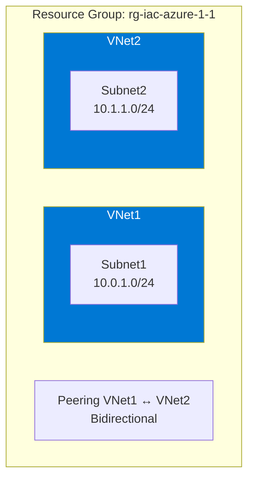
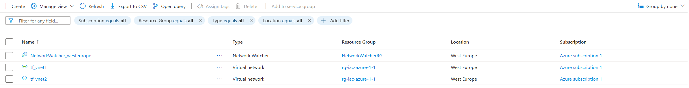
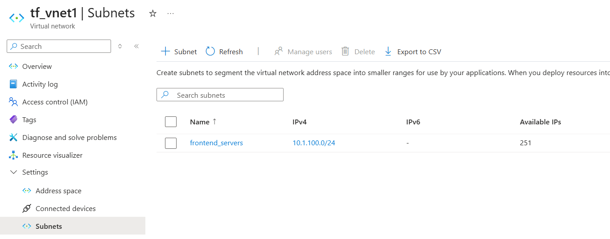
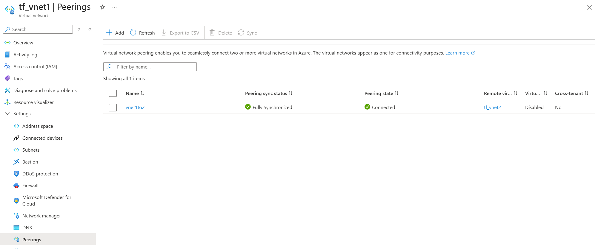

# IaC_AZURE_1_1: Azure Virtual Network Peering with Terraform

**Pet project demonstrating Azure Networking (AZ-700) and Infrastructure as Code (Terraform Associate 004) skills.**

This project creates two Virtual Networks (VNets) in a single Resource Group with bidirectional peering and one subnet in each VNet.  
Clean, production-ready infrastructure built with Terraform best practices.

### Architecture

**VNETs**

**Vnet1 subnet**

**Bidirectional VNet Peering (status Connected)**
